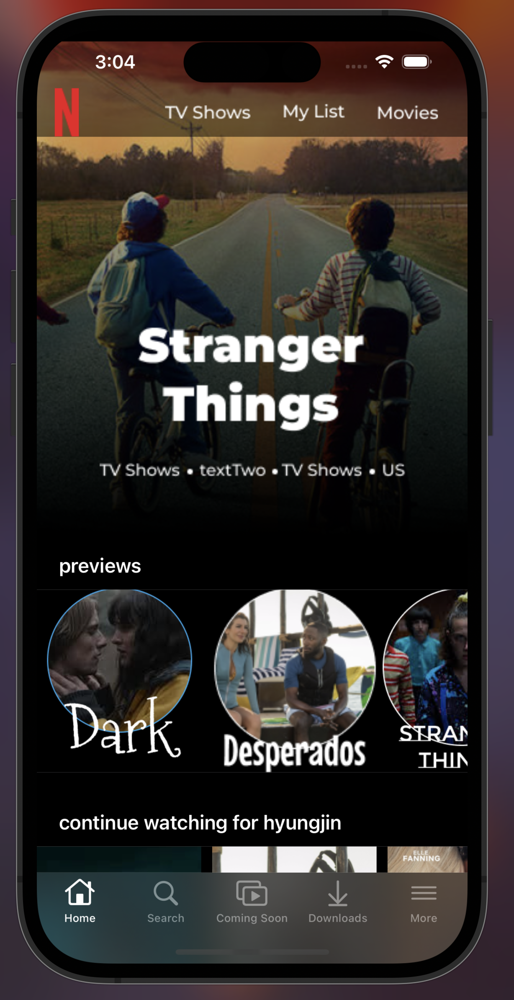
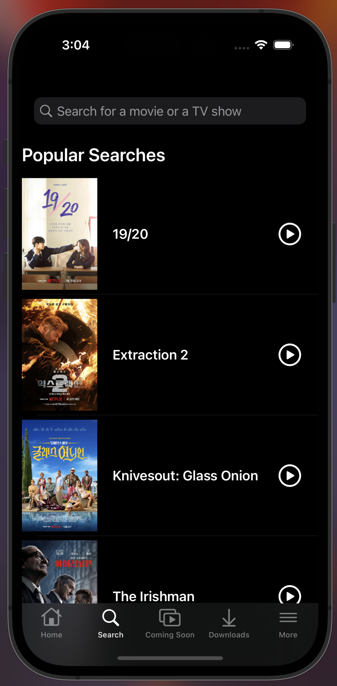
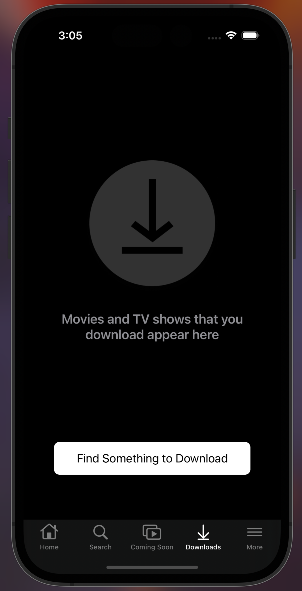

# IOS_HyungjinKim

# Netflix Clone

A Netflix clone built using Swift and UIKit to replicate the design and functionality of the official Netflix app. This clone aims to imitate the core features of Netflix, including browsing, searching, and downloading content.

## Screenshots

### Homepage

### Search Page

### Download Page

## Features

- **Browsing:** Users can browse through a variety of movies and TV shows just like in the original app.
- **Search:** A search functionality that allows users to search for their favorite movies and TV shows.
- **Downloads:** Users can download content for offline viewing.

